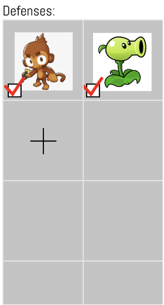
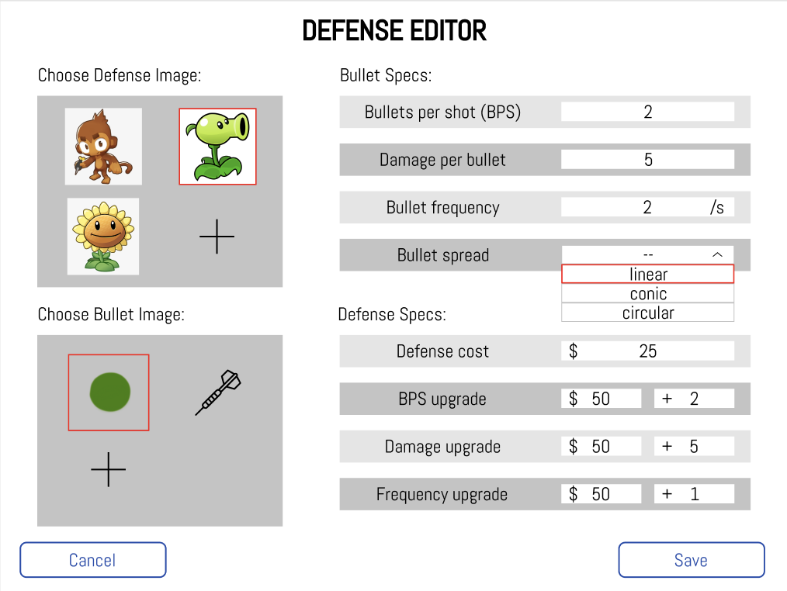

# **Crouton: Frontend**
Angel Huizar, Shreya Hurli, Gaby Rodriguez-Florido, Samantha Whitt

---

# **Design**

---

### Architecture: 
*Hierarchical-based with abstraction*
- Views
- Controllers
- ClickableNode

---

### Views
*Groups visual components based on semantic purposes related to using the authoring environment*

### Subclass Extension: Editor
*Specific view that takes in user input per authoring component such as game mode, level, defense, enemy, and projectile*

---

### View vs. Editor Example

---

---

---

### Controllers
*Provides a behavior for a component it's instantiated by, sends to backend information needed to be stored*

**Design Tradeoff:** abstraction versus reflection

---

### Clickable Nodes
*Generalizes all clicking/interacting components with an onClickAction() method and calling its controller's execute() method*

### Subclass Extension: ClickableObjects
*Creates each clickable component on the UI*

---

### Goals
- **Flexibility:** testing/functioning independently from other sub-teams
- **Legibility:** creating shorter, understandable classes and methods
- **Extensibility:** easily adding UI components and behavior
- **XML incorporation:** backend creating and updating

---

# **Features**

---

### General Features
*All authoring elements are based on options provided to the user. Thus, features that have editors are open to modification in terms of user input, but something like creating a new behavior without choosing from an editing option is closed.*

---

### Current Features
- Drag Path
- Color selector
- Tower, Level, Game Mode, Enemy, and Defense Editors

**Design Tradeoff:** ImageSelector per editor

---

### Future Expectations
- **Frontend:** integrating views with editors, communicating with the backend via ID (calling creates and updates), building game player environment
- **Data:** testing, taking user inputs and sending to engine
- **Backend:** creating working objects that frontend can call to and update appropriately
- **Game Designers/Maintainers:** adding new features via new classes

---

# **Demo**
[wireframe](https://www.figma.com/file/pkLgLnRf0OOvqX0MHVLp1a/Crouton?node-id=0%3A1)

---

# **Coming soon to a theater near you! Thank you.**
